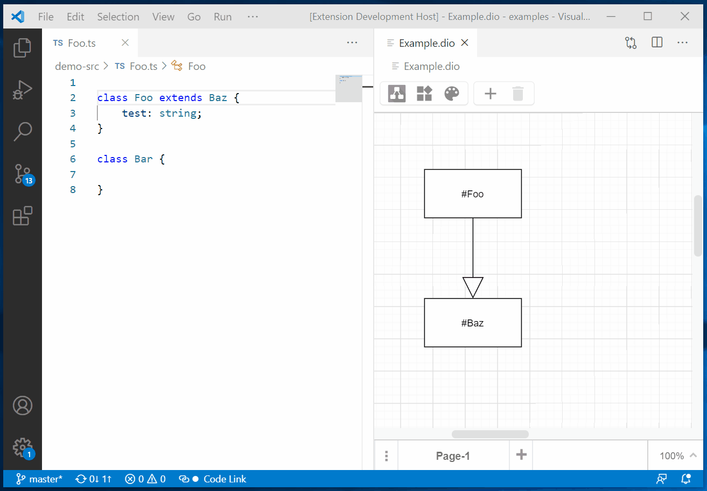
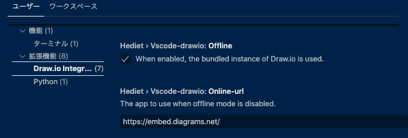
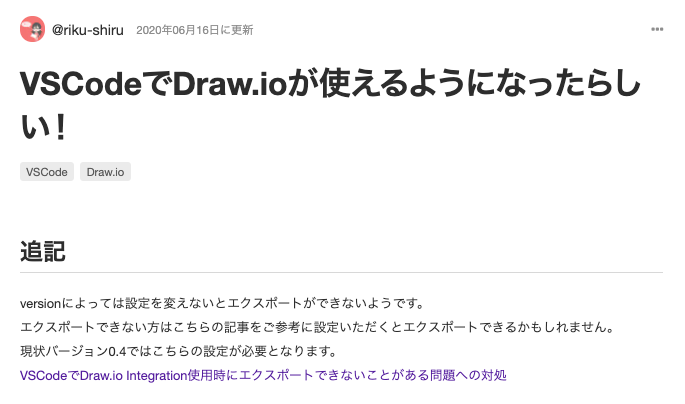
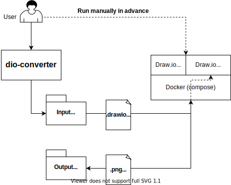
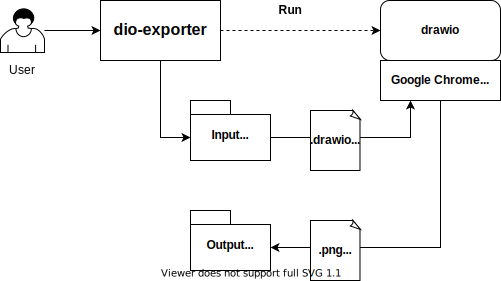
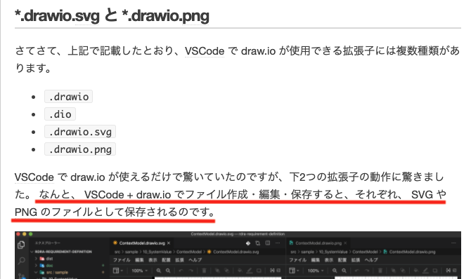
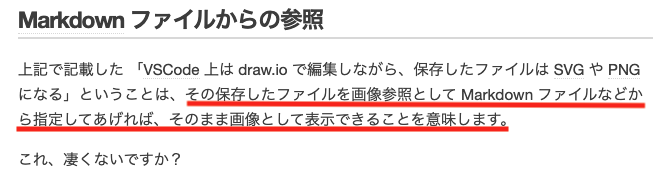
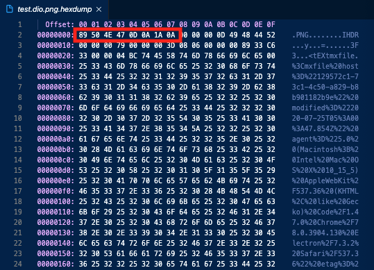
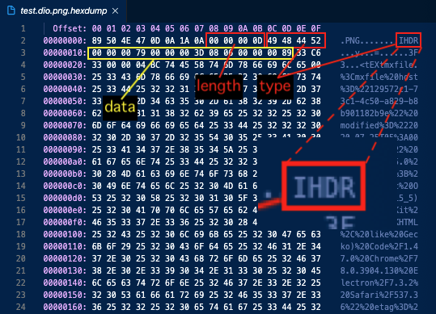
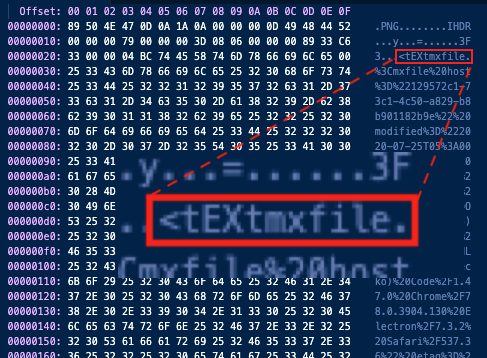

<!--
headingDivider: 2
-->

# VS Code Draw.io Integrationで作成した図を画像ファイルとして取り込む

## Background


* コード書いてると処理概要の整理のためにちょっとした図を描きたくなることがある 


## Background
* Microsoft Office
  * PowerPoint: Canvasのサイズが決まってる / コネクタ貼りづらい
  * Excel: 表計算ソフトでは？
* [Mermaid](https://mermaid-js.github.io/mermaid/#/)
  * テキストでMarkdownファイル内に書けるのは良い
  * 変換ツール要? 複雑なものだと管理しきれなそう...
* Draw.io
  * コネクタ貼り易い (**重要**)
  * サーバーを立てておく必要ある
  * Webアプリなので作成した図をエクスポートして取り込んだりする手間

# [Draw.io Integration | VisualStudio Marketplace](https://marketplace.visualstudio.com/items?itemName=hediet.vscode-drawio)



## 大勝利 🎉 

* スタンドアロンのためDraw.ioサーバー不要！
* Markdown編集からシームレスに図の編集も可能に！


## 大勝利 🎉 ...なのか？

* スタンドアロンのためDraw.ioサーバー不要！
  * -> 本当に？ 「**会社の資料作ってたら実は外部に転送されてた**」とか無い？
* Markdown編集からシームレスに図の編集も可能に！
  * -> 結局、画像ファイルへの変換は必要になるのでは？


# 疑問1: 本当にスタンドアロンで起動してるの？

## 本当にスタンドアロンで起動してるの？ (1/4)

* VSCodeの設定を見ると、**Offline mode** と **Online Mode** があるらしい
  * **Offline mode**: バンドル済みのDraw.ioを使う
  * **Online mode**: `Oneline-url` に指定されたサーバーを使う(多分)
    * Draw.ioはプラグインがあったりするので、それを利用するため?



## 本当にスタンドアロンで起動してるの？ (2/4)

* コードを "offline" で検索するとそれっぽいメソッドが見つかる[^1]

```
config: DiagramConfig,
  options: DiagramOptions,
  webview: Webview
): string {
  if (config.mode.kind === "offline") {
    return this.getOfflineHtml(config, options, webview);  <---
  } else {
    return this.getOnlineHtml(config, config.mode.url);
  }
}
```

[^1]: https://github.com/hediet/vscode-drawio/blob/67334cca353d8ed093ef7e4877250a312154cd2d/src/DrawioAppServer/DrawioWebviewInitializer.ts#L85

## 本当にスタンドアロンで起動してるの？ (3/4)

* どうやらwebviewでローカルのファイルを表示しているだけらしい [^2]
* `../../drawio` はgit submoduleとして持っているDraw.ioリポジトリのパス

```
  private getOfflineHtml(
    config: DiagramConfig,
    options: DiagramOptions,
    webview: Webview
  ): string {
    const vsuri = webview.asWebviewUri(  <---
      Uri.file(path.join(__dirname, "../../drawio/src/main/webapp"))
    );
    const customPluginsPath = webview.asWebviewUri(
    ...
```

[^2]: https://github.com/hediet/vscode-drawio/blob/67334cca353d8ed093ef7e4877250a312154cd2d/src/DrawioAppServer/DrawioWebviewInitializer.ts#L96

## 本当にスタンドアロンで起動してるの？ (4/4)

* 本当にスタンドアロンで立ってるっぽい
  * 他にも社内でプロキシ切った状態で立ち上げてみたり、DevToolsでネットワークを見てみたりもしたけど問題なさそうだった
* (アップデートで挙動変わったりするのが少し怖い)


# 疑問2: 結局、画像ファイルへの変換は必要になるのでは？

## 結局、画像ファイルへの変換は必要になるのでは？(1/4)

https://qiita.com/riku-shiru/items/5ab7c5aecdfea323ec4e


* v0.4でエクスポートメニュー非表示 (対処はOnline modeにすること)

## 結局、画像ファイルへの変換は必要になるのでは？(2/4)

* Issueを見るとPNG出力機能は開発済み？
  * 現時点(2020/07/22)での最新版v0.7.2ではエクスポートメニューは無く...

[Support PNG Export · Issue \#56 · hediet/vscode\-drawio](https://github.com/hediet/vscode-drawio/issues/56)
> It would be useful if Draw.io diagrams could be exported to PNG files.

https://github.com/hediet/vscode-drawio/issues/56#issuecomment-633490768
> As you can see, this feature has been released to insiders:

## 結局、画像ファイルへの変換は必要になるのでは？(3/4)

* PDFエクスポートについては対応する気がなさそう

[can‘t export file · Issue \#34 · hediet/vscode\-drawio](https://github.com/hediet/vscode-drawio/issues/34#issuecomment-629163527)
  > Because export does not work and I don't think exporting things is a great user experience, I will rather try to hide the export options alltogether (#22).
  > If you think it is a must have, please convince me ;) A cli should be the way to go for exports.

## 結局、画像ファイルへの変換は必要になるのでは？(4/4)

* (現時点では) 公式にサポートされる雰囲気ではなさそう
* そもそもExport機能があっても手動実行が必要になるのでは？

* 自分で作っちゃおう 🛠️

## そして出来たもの

### [kaakaa/dio-converter](https://github.com/kaakaa/dio-converter)
* Draw.io公式の画像エクスポートWebアプリケーションを利用
  * [jgraph/draw\-image\-export2](https://github.com/jgraph/draw-image-export2)
    * > The 2018 server\-side PNG/PDF export implementation using Node, Puppeteer and Chrome headless
  * ↑の[Dockerイメージ](https://hub.docker.com/r/jgraph/export-server) ([GitHub](https://github.com/jgraph/docker-drawio/tree/master/image-export)) を使っている
  * Draw.ioの `/export3.html` を使っている
    * ドキュメント化されてない隠し機能？



## しかし...

事前に `docker-compose` でアプリ立ち上げるとか面倒臭い...
結局DockerでDraw.ioサーバー立ててるのとあまり変わらないのでは...

# あれ？Draw.ioはアプリ起動する必要ないのでは？

(VS Code Extensionではwebviewでファイルを開いてるだけ)

## 顧客が必要だったもの



### [kaakaa/dio-exporter](https://github.com/kaakaa/dio-exporter)

* GoでDraw.ioファイルサーバーを起動
  * [http.FileServer](https://golang.org/pkg/net/http/#FileServer)
* GoでHeadless Chromeを操作する [chromedp](https://github.com/chromedp/chromedp) を使用
  * `/export3.html` へ `*.drawio` ファイルを送信
  * 描画された図をスクリーンショットで取得

## 顧客が必要だったもの (開発)

### [kaakaa/dio-exporter](https://github.com/kaakaa/dio-exporter)
* テスト
  * テスト用`*.drawio`ファイルから生成される画像の一致テスト
    * ~~[pixelmatch](https://github.com/mapbox/pixelmatch)を使用して生成されるPNGの一致チェック~~
    * 環境により日本語フォントに差異があるためSVG形式のみのテスト
  * GitHub Actionsでテスト実行
* リリース作成時にIssue, PRのタグを見てリリースノートを作成

# ええもんでけた

# 同じ問題で困ってる人がいないかTwitterで検索...

## あれ？

https://blog.anfangd.me/entry/2020/07/08/220628

## あれれ？


https://blog.anfangd.me/entry/2020/07/08/220628

# これ、凄くないですか？

# これ、凄く（`dio-exporter`必要なく）ないですか？

# 終 (ではない)

# いや、バイナリファイル(PNG)にXML情報(drawio)埋め込めるわけないやろ！

イチャモン

## `*.drawio.png` の中身



* [hexdump for VSCode](https://marketplace.visualstudio.com/items?itemName=slevesque.vscode-hexdump) で開く

* [PNGを読む \- Qiita](https://qiita.com/kouheiszk/items/17485ccb902e8190923b)
> PNGファイルではファイルの先頭に8バイトの 89 50 4E 47 0D 0A 1A 0A　が存在するようです。文字列にすると \x89PNG\r\n\x1a\n こうなります。

## `*.drawio.png` の中身

* [PNGを読む \- Qiita](https://qiita.com/kouheiszk/items/17485ccb902e8190923b)
> 最初の8バイトのPNGシグネチャをのぞいて、チャンクというデータのまとまりが続きます。

| 種類 | サイズ | 説明 |
|:----:|:----:|:-----|
| length | 4 bytes | チャンクのdata部分のバイト数を表す |
| type | 4 bytes | 4文字でチャンクの種類を表す |
| data | 可変長 bytes | lengthで指定されたbyte長のチャンクのデータ |
| CRC | 4 bytes | typeとdataのCRCで、データの破損をチェックできる |


## `*.drawio.png` の中身



* [PNGを読む \- Qiita](https://qiita.com/kouheiszk/items/17485ccb902e8190923b)
> 最初の8バイトのPNGシグネチャをのぞいて、チャンクというデータのまとまりが続きます。


## `*.drawio.png` の中身



`mxfile`...?
`*.drawio`ファイルの中身では...?

```
<mxfile   <---
  host="f1e0d6ca-e141-42aa-960f-eede6d01d428"
  modified="2020-07-26T05:56:53.199Z"
  agent="5.0 (Macintosh; ..."
  etag="r0m-Pgl4D5wC1QD8uaEo"
  version="13.1.3">
    <diagram ...
```

## `*.drawio.png` の中身
* Draw.ioのコード見る [^3]

```
//PNG+XML format
if (data.xml.substring(0, 5) == 'iVBOR' || (extras != null && extras.isPng))
{
  data.xml = Editor.extractGraphModelFromPng('data:image/png;base64,' + data.xml);
}
```

> extractGraphModelFromPng

ぁゃιぃ...


[^3]: https://github.com/jgraph/drawio/blob/650072534887bb4eb25c25292c93510b458cf2a9/src/main/webapp/export3.html#L75

## `*.drawio.png` の中身

* zTXt or tEXt チャンクにDraw.ioのXMLデータ入ってるっぽい [^4]

```
Editor.extractGraphModelFromPng = function(data)
...
  if (type == 'zTXt')
  {
    ...
  }
  // Uncompressed section is normally not used
  else if (type == 'tEXt')
  {
    ...
  }			
```

[^4]: https://github.com/jgraph/drawio/blob/a579fe9c094510093db631283166f35588848113/src/main/webapp/js/diagramly/Editor.js#L1547


## `*.drawio.png` の中身


`tEXt` チャンク。なるほど。

## `*.drawio.png` の中身

```
$ go run png.go 
chunk: IHDR <--- 画像のサイズやカラータイプなどのメタデータ
chunk: tEXt <--- Draw.ioデータ (URLEncoded)
chunk: IDAT <--- PNGデータ
chunk: IEND <--- 画像データの終端

tEXt chunk:
  mxfile<mxfile 
  host="6b69cf35-3cdc-4e90-9822-4718dea9a24a"
  modified="2020-07-26T05:16:42.690Z"
  ...
>
  <diagram id="ooyZYogMv9WS_nOPFq-w" name="ページ1">
    ...
  </diagram>
</mxfile>
```

## `*.drawio.png` の中身

https://ja.wikipedia.org/wiki/Portable_Network_Graphics
* tEXt - ISO 8859-1形式のテキストを保持する。キーワードと対になるチャンクを複数持つことができる。テキストの圧縮は行われない。
* zTXt - tEXtチャンクと同じ制限の圧縮テキスト。

## `*.drawio.png` の中身

* Draw.ioでは`tEXt`チャンクはあまり使われない？
  * エディタでの編集は保存回数が多く、毎回圧縮処理をかけるとパフォーマンスに影響がでそうだから？
  * WebアプリではExportの時に圧縮、import時に解凍すれば良い

```
  if (type == 'zTXt')
  {
    ...
  }
  // Uncompressed section is normally not used
  else if (type == 'tEXt')
  {
    ...
  }
```

[^4]: https://github.com/jgraph/drawio/blob/a579fe9c094510093db631283166f35588848113/src/main/webapp/js/diagramly/Editor.js#L1547

## `*.drawio.svg` の中身

* `svg`タグの`content`属性にDraw.ioのデータが入っている

```
<svg
  xmlns="http://www.w3.org/2000/svg"
  xmlns:xlink="http://www.w3.org/1999/xlink"
  version="1.1"
  width="463px"
  ...
  content="&lt;mxfile host=&quot;78e38da8-5c2e-49bf-9...  <---
  ...
```

# 顧客が本当に必要だったもの

* [VisualStudio Code](https://code.visualstudio.com/)
* [VisualStudio Code Draw.io Integration](https://marketplace.visualstudio.com/items?itemName=hediet.vscode-drawio)
* `*.drawio.png` or `*.drawio.svg` ファイル
  * (最後のページしか画像表示できないっぽいので、複数ページのDraw.ioファイルを反復的に画像化したい場合は [kaakaa/dio-exporter](https://github.com/kaakaa/dio-exporter) を...)

# 終